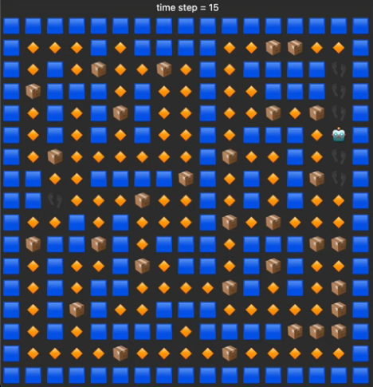

Hello! I am currently in the progress of cleaning up and recreating this project. I've been rewriting the RL implementations from scratch with my own code runner (seems like a good exercise), and retraining everything and I'll update the repository once it's ready.

In the meantime, here's a brief summary of the repository:

The goal of this project is to train some deep-RL policies to play the game of [Bomberman](https://en.wikipedia.org/wiki/Bomberman), which I really liked playing as a kid.

  

A sample video showing a partially trained policy rollout of one of my PPO-agents trained from scratch can be found [here](https://www.youtube.com/shorts/jVk0F8xhEyQ) 

We use the [easyrl](https://github.com/taochenshh/easyrl) PPO implementation.

A short summary of the contents is located in summary.md